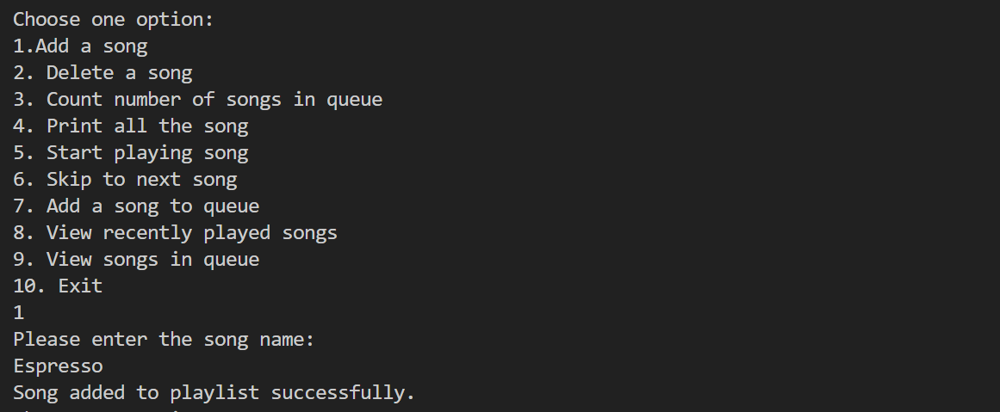
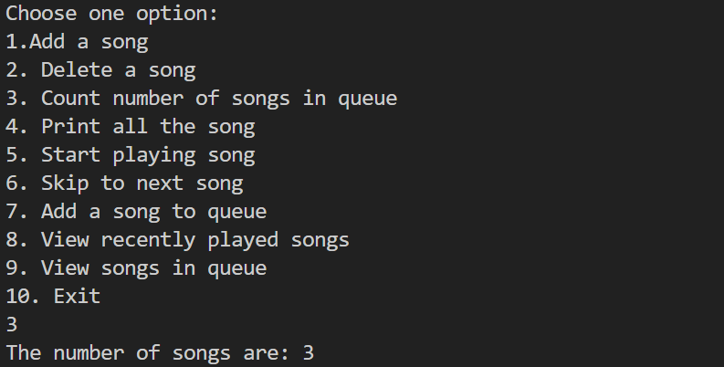
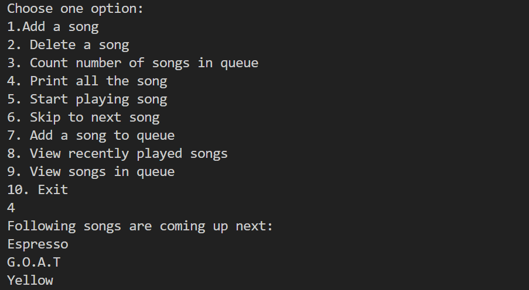
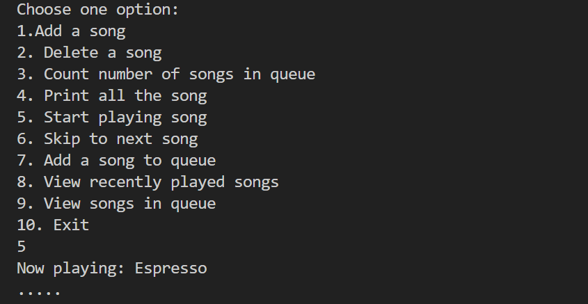
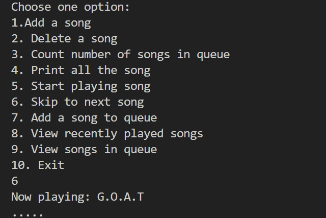

## MUSIC PLAYER

Requirements: C++ 

## Project Overview
The purpose of this project is to use various data structres like doubly linked list, queues, stacks etc and build a basic structure of a music player with it.
Every song is represented as a node with a string (which contains the na,e of the song) and a pointer to next song and previous songs. 
All the songs that have been played go into stack that has all the recently played songs.
We can also add songs in a queue which are stored in a queue data structure.

## Functions used:

1. Add song: If the user wants to add a song to the playlist.
2. Delete song: If the user wants to remove a song form the playlist. Furthur we can delete a song by the song number/index or by searching the name of it.
3. Count songs: Counts the number of songs that are inside the playlist.
4. Print list: If the user wants to see the entire playlist.
5. Play song: So that user can play song (The song doesn't actually plays, it is just a demonstration of it).
6. Next song: If user wants to skip to the next song.
7. Add to queue: If the user wants to add a song to queue. (While playing, songs in the queue are prioritised than the ones in the playlist).
8. Recent songs: Gives complete list os songs that the user has played.
9. Songs in queue: Gives complete list of songs that have been added to queue by the user.
10. End: In order to exit the menu.

## Output Snippets

1. Add a song: 

2. Count number of songs

3. Print all the songs 

4. Start playing a song

5. Play the next song

